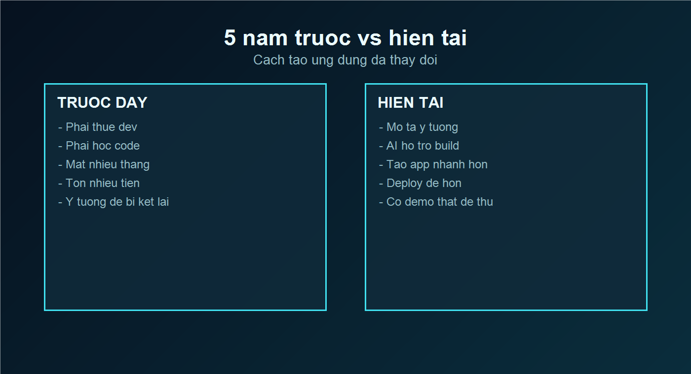
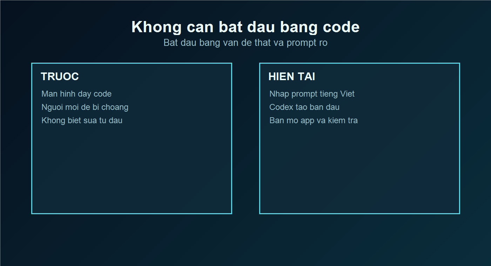
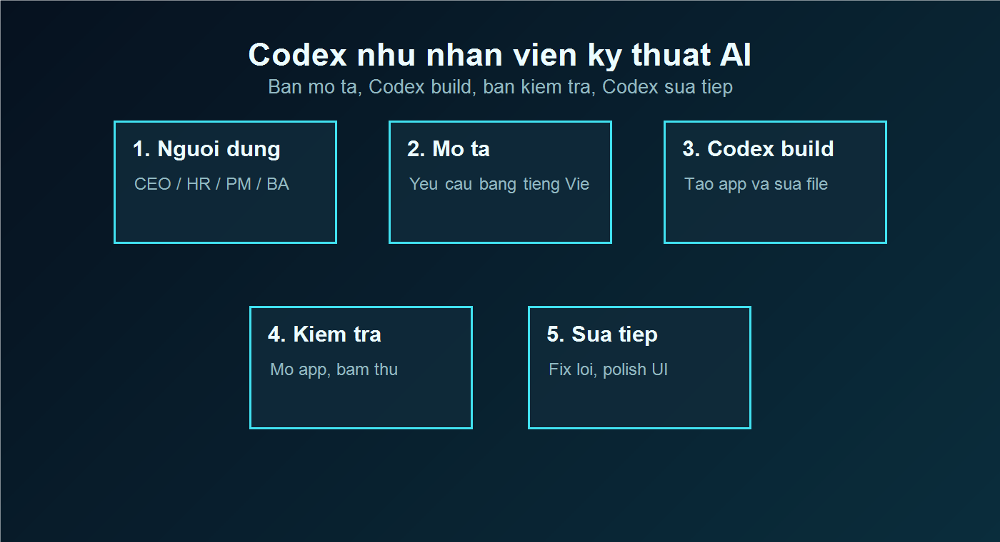
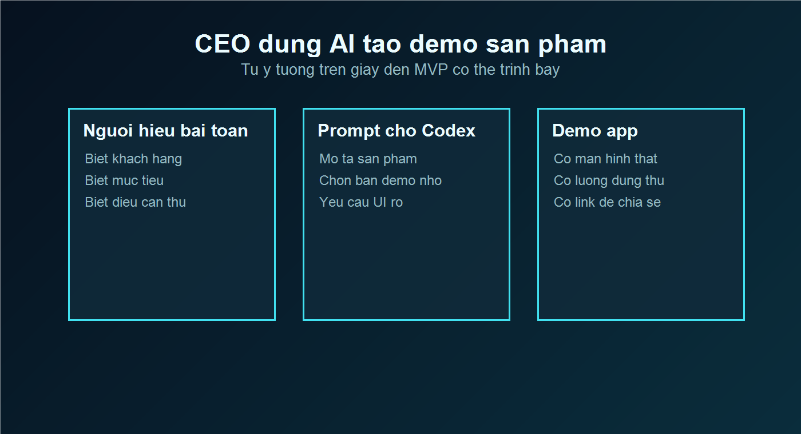
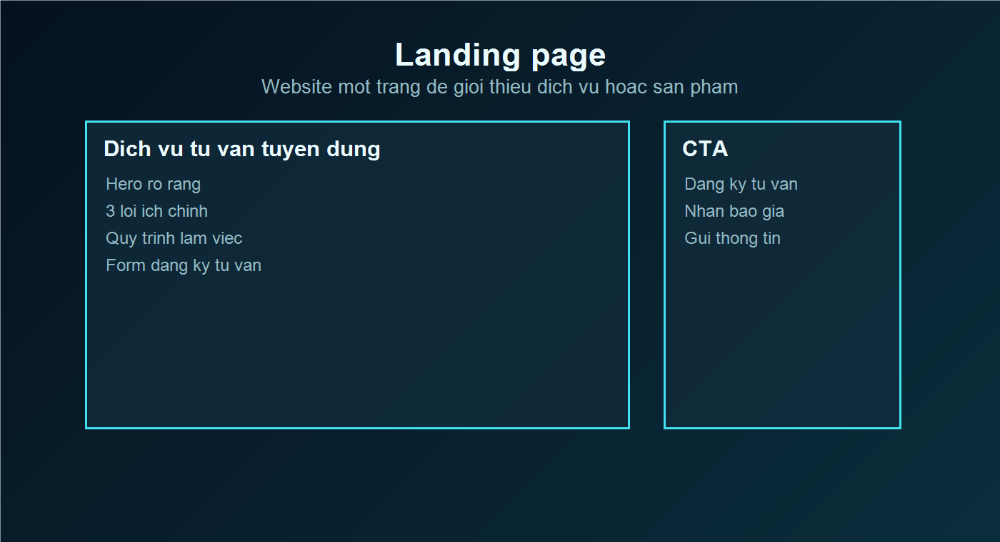
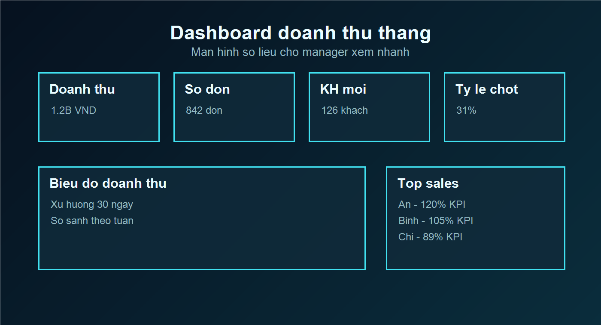
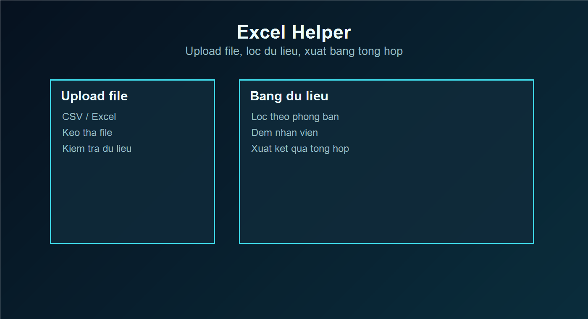
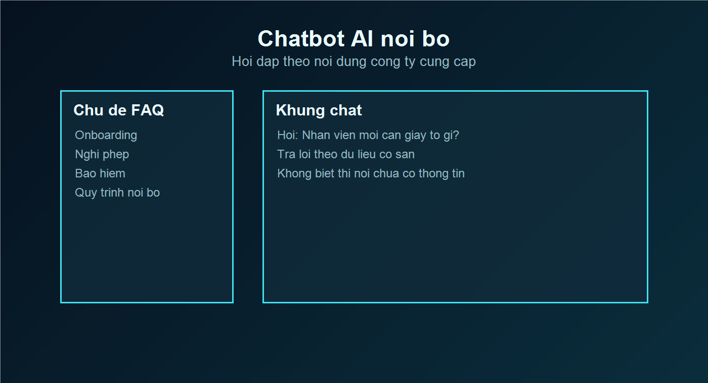
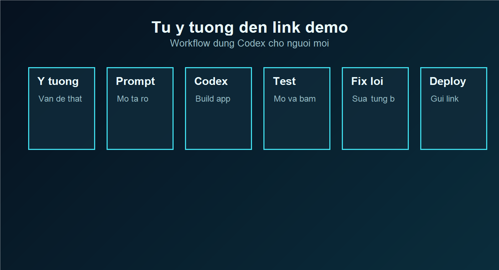
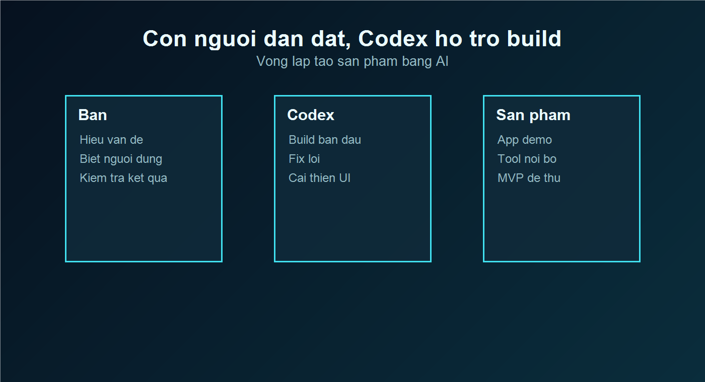

# 00. Người không biết lập trình vẫn có thể tạo ứng dụng bằng AI

> Chapter mở đầu của ebook **Codex Zero To Hero Việt Nam**.
>
> Mục tiêu duy nhất: giúp bạn cảm thấy rõ ràng rằng **AI thật sự có thể giúp mình tạo ứng dụng, công cụ và sản phẩm demo dù mình không biết code**.
>
> Bản visual preview đẹp hơn để xem trong trình duyệt: [chapter-00-visual-preview.html](../export/chapter-00-visual-preview.html)

---

## Cách đọc chapter này

Chapter này không dạy lập trình.

Chapter này giúp bạn nhìn thấy một bức tranh mới:

```text
Trước đây:
Ý tưởng -> chờ người biết code -> tốn thời gian -> tốn tiền -> dễ bỏ cuộc

Hiện tại:
Ý tưởng -> mô tả cho AI -> Codex hỗ trợ build -> bạn kiểm tra -> có demo thật
```

Bạn không cần hiểu code ngay từ đầu. Bạn chỉ cần hiểu **mình muốn tạo gì, cho ai dùng, và kết quả cần trông như thế nào**.

---

# Phần 1 — 5 năm trước vs hiện tại

## Infographic: Cách tạo ứng dụng đã thay đổi



**Tên ảnh:** `00-before-vs-now-infographic.png`

**Mô tả ảnh:** Infographic chia đôi màn hình. Bên trái là "5 năm trước", có hình người dùng đứng trước bức tường kỹ thuật với các nhãn: thuê dev, học code, chờ nhiều tháng, chi phí cao. Bên phải là "Hiện tại", có người dùng nhập ý tưởng vào laptop, AI hỗ trợ build app, deploy nhanh, có link demo.

**Style:** Dark mode, xanh đen, AI futuristic, clean, glassmorphism nhẹ, icon line-art hiện đại.

**Vị trí đặt:** Ngay sau tiêu đề "5 năm trước vs hiện tại".

---

## Trước đây

```text
Ý tưởng
  ↓
Viết yêu cầu
  ↓
Tìm dev hoặc chờ team IT
  ↓
Chờ thiết kế, chờ code, chờ sửa
  ↓
Tốn nhiều tuần hoặc nhiều tháng
  ↓
Mới có bản demo đầu tiên
```

Với người không chuyên kỹ thuật, hành trình này thường rất nặng.

Bạn có thể là CEO có ý tưởng sản phẩm mới. Bạn có thể là manager muốn tạo dashboard nội bộ. Bạn có thể là HR muốn bớt làm Excel thủ công. Nhưng chỉ vì không biết code, ý tưởng dễ bị kẹt lại ở mức "để sau".

## Hiện tại

```text
Ý tưởng
  ↓
Mô tả bằng tiếng Việt
  ↓
Codex hỗ trợ build
  ↓
Bạn xem bản demo
  ↓
Bạn yêu cầu sửa
  ↓
Có sản phẩm đầu tiên nhanh hơn rất nhiều
```

Điểm thay đổi lớn nhất không phải là "ai cũng thành lập trình viên".

Điểm thay đổi lớn nhất là: **người hiểu công việc có thể trực tiếp tham gia tạo công cụ cho chính công việc đó**.

---

## Mockup: Before vs After Coding



**Tên ảnh:** `00-before-after-coding.png`

**Mô tả ảnh:** Bên trái là màn hình đầy code khó hiểu, người dùng non-tech nhìn bối rối. Bên phải là người dùng nhập prompt tiếng Việt: "Tạo dashboard doanh thu tháng", bên cạnh là app dashboard hiện ra.

**Style:** Startup ebook hiện đại, nền xanh đen, ánh sáng AI nhẹ, giao diện kính mờ, chữ lớn dễ đọc.

**Vị trí đặt:** Sau phần so sánh "Trước đây" và "Hiện tại".

---

# Phần 2 — Codex là gì?

## Codex giống như một nhân viên kỹ thuật AI

Không cần nghĩ Codex là thứ gì quá phức tạp.

Hãy tưởng tượng bạn có một nhân viên kỹ thuật AI ngồi cạnh:

- Bạn nói mục tiêu.
- Codex tạo bản đầu tiên.
- Bạn mở lên xem.
- Bạn nói chỗ nào chưa đúng.
- Codex sửa tiếp.
- Dần dần hình thành sản phẩm.

Bạn là người hiểu vấn đề. Codex là người hỗ trợ triển khai.

---

## Flow diagram: Làm việc với Codex

```text
┌────────────────────┐
│  Người dùng         │
│  CEO / HR / PM / BA │
└─────────┬──────────┘
          ↓
┌────────────────────┐
│  Mô tả yêu cầu      │
│  bằng tiếng Việt    │
└─────────┬──────────┘
          ↓
┌────────────────────┐
│  Codex build        │
│  tạo file, sửa app  │
└─────────┬──────────┘
          ↓
┌────────────────────┐
│  Người dùng kiểm tra│
│  nhìn, bấm, góp ý   │
└─────────┬──────────┘
          ↓
┌────────────────────┐
│  Codex sửa tiếp     │
│  fix lỗi, polish UI │
└─────────┬──────────┘
          ↓
┌────────────────────┐
│  Ra sản phẩm demo   │
│  app / tool / MVP   │
└────────────────────┘
```



**Tên ảnh:** `00-codex-ai-engineer-flow.png`

**Mô tả ảnh:** Flowchart dọc gồm 6 bước: Người dùng, Mô tả yêu cầu, Codex build, Người dùng kiểm tra, Codex sửa tiếp, Ra sản phẩm. Mỗi bước có icon: người dùng, bong bóng chat, chip AI, kính lúp kiểm tra, cờ lê sửa lỗi, rocket sản phẩm.

**Style:** Dark mode, xanh đen, glassmorphism card, mũi tên neon xanh, cực dễ hiểu.

**Vị trí đặt:** Sau flow diagram text.

---

## Mockup: CEO dùng AI build app



**Tên ảnh:** `00-ceo-using-ai-build-app.png`

**Mô tả ảnh:** Một CEO hoặc manager Việt Nam đang ngồi trong văn phòng hiện đại, nhập prompt vào laptop. Trên màn hình hiện ra bản demo app nội bộ. Phía sau là bảng ý tưởng sản phẩm và timeline MVP.

**Style:** Hiện đại, startup Việt Nam, dark office, ánh sáng xanh AI, clean, truyền cảm hứng.

**Vị trí đặt:** Sau phần giải thích "Codex giống nhân viên kỹ thuật AI".

---

# Phần 3 — Ví dụ thực tế

Phần này là để bạn nhìn thấy ngay: Codex không chỉ dành cho lập trình viên.

Codex có thể giúp tạo các công cụ rất gần với công việc hằng ngày.

---

## 1. Landing page



**Tên ảnh:** `00-landing-page-mockup.png`

**Mô tả ảnh:** Mockup website một trang cho dịch vụ tư vấn tuyển dụng. Có hero section, nút "Đăng ký tư vấn", 3 lợi ích, quy trình 3 bước, form liên hệ.

**Style:** Dark mode sang trọng, xanh đen, card kính mờ, CTA nổi bật màu xanh neon nhẹ, layout startup hiện đại.

**Vị trí đặt:** Đầu subsection "Landing page".

**Prompt ngắn:**

```text
Tạo landing page cho dịch vụ tư vấn tuyển dụng dành cho doanh nghiệp vừa và nhỏ ở Việt Nam.
Trang cần có lợi ích, quy trình, bảng giá tham khảo và form liên hệ.
```

**Kết quả tạo ra:**

- Một website giới thiệu dịch vụ.
- Có nội dung mẫu.
- Có nút kêu gọi hành động.
- Có form để khách hàng để lại thông tin.

**Ai dùng được?**

CEO, founder, marketing, sales, HR agency, trung tâm đào tạo.

---

## 2. Dashboard



**Tên ảnh:** `00-dashboard-mockup.png`

**Mô tả ảnh:** Dashboard doanh thu tháng. Có KPI card: doanh thu, số đơn, khách hàng mới, tỷ lệ chốt. Có biểu đồ doanh thu 30 ngày, bảng top nhân viên sales, bộ lọc theo khu vực.

**Style:** Dark mode, xanh đen, biểu đồ sáng rõ, card glassmorphism, font hiện đại, cảm giác SaaS dashboard chuyên nghiệp.

**Vị trí đặt:** Đầu subsection "Dashboard".

**Prompt ngắn:**

```text
Tạo dashboard doanh thu tháng cho sales manager.
Cần có doanh thu, số đơn, khách hàng mới, tỷ lệ chốt và bảng xếp hạng nhân viên.
```

**Kết quả tạo ra:**

- Màn hình theo dõi số liệu.
- Biểu đồ dễ nhìn.
- Bảng xếp hạng nhân viên.
- Giao diện phù hợp để xem trong cuộc họp.

**Ai dùng được?**

CEO, sales manager, operation manager, finance, trưởng phòng.

---

## 3. Excel helper



**Tên ảnh:** `00-excel-helper-mockup.png`

**Mô tả ảnh:** Giao diện upload file CSV/Excel. Bên trái là khu vực kéo thả file, bên phải là bảng dữ liệu nhân viên. Bên dưới có phần tổng hợp theo phòng ban và nút "Xuất kết quả".

**Style:** Dark mode sạch, bảng dữ liệu rõ ràng, icon file Excel, màu xanh đen, nút hành động nổi bật.

**Vị trí đặt:** Đầu subsection "Excel helper".

**Prompt ngắn:**

```text
Tạo tool upload file CSV danh sách nhân viên.
Tool cần lọc theo phòng ban, đếm số nhân viên mỗi phòng ban và xuất bảng tổng hợp.
```

**Kết quả tạo ra:**

- Tool hỗ trợ xử lý dữ liệu bảng.
- Giảm thao tác thủ công trong Excel.
- Có thể dùng dữ liệu mẫu để demo trước.

**Ai dùng được?**

HR, admin, backoffice, kế toán nội bộ, vận hành.

---

## 4. Chatbot AI



**Tên ảnh:** `00-chatbot-ai-mockup.png`

**Mô tả ảnh:** Giao diện chatbot nội bộ. Bên trái là danh sách chủ đề FAQ: onboarding, nghỉ phép, bảo hiểm, quy trình nội bộ. Bên phải là khung chat hỏi đáp. Một câu hỏi mẫu: "Nhân viên mới cần chuẩn bị giấy tờ gì?"

**Style:** Dark mode, xanh đen, bong bóng chat glassmorphism, icon AI assistant, bố cục gọn và dễ đọc.

**Vị trí đặt:** Đầu subsection "Chatbot AI".

**Prompt ngắn:**

```text
Tạo chatbot FAQ cho nhân viên mới.
Chatbot chỉ trả lời dựa trên nội dung onboarding tôi cung cấp.
Nếu không có dữ liệu, hãy nói chưa có thông tin.
```

**Kết quả tạo ra:**

- Giao diện chat đơn giản.
- Trả lời câu hỏi theo nội dung có sẵn.
- Phù hợp làm demo chatbot nội bộ.

**Ai dùng được?**

HR, admin, training, customer support, product team.

---

# Phần 4 — Workflow dùng Codex

## Visual workflow: Từ ý tưởng đến sản phẩm demo

```text
┌──────────┐
│ Ý tưởng  │
└────┬─────┘
     ↓
┌──────────┐
│ Prompt   │
│ mô tả rõ │
└────┬─────┘
     ↓
┌──────────┐
│ Codex    │
│ build    │
└────┬─────┘
     ↓
┌──────────┐
│ Test     │
│ mở và bấm│
└────┬─────┘
     ↓
┌──────────┐
│ Fix lỗi  │
│ sửa từng │
│ bước     │
└────┬─────┘
     ↓
┌──────────┐
│ Deploy   │
│ gửi link │
└──────────┘
```



**Tên ảnh:** `00-codex-workflow-idea-to-deploy.png`

**Mô tả ảnh:** Workflow ngang 6 bước: Ý tưởng, Prompt, Codex, Test, Fix lỗi, Deploy. Mỗi bước nằm trong card kính mờ, có icon lớn, mũi tên nối giữa các bước. Bước cuối có rocket và link demo.

**Style:** Dark mode, xanh đen, AI futuristic, clean, glassmorphism nhẹ, tối ưu cho ebook PDF.

**Vị trí đặt:** Sau visual workflow text.

---

## Cách hiểu đơn giản

Bạn không cần làm tất cả trong một lần.

Hãy làm theo vòng lặp nhỏ:

```text
Nói rõ một việc nhỏ
  ↓
Codex làm bản đầu
  ↓
Bạn xem thử
  ↓
Bạn nói chỗ cần sửa
  ↓
Codex sửa tiếp
```

Ví dụ:

```text
Đầu tiên hãy tạo landing page đơn giản.
Sau khi chạy được, hãy cải thiện giao diện.
Sau đó hãy thêm form liên hệ.
Cuối cùng hãy hướng dẫn tôi deploy.
```

Đây là cách người không biết code vẫn có thể đi từ ý tưởng đến demo thật.

---

# Phần 5 — Điều quan trọng nhất

## Codex không thay thế con người 100%

Codex rất mạnh, nhưng bạn vẫn là người dẫn dắt.

Codex có thể build nhanh. Nhưng Codex không tự biết toàn bộ bối cảnh công ty bạn, khách hàng của bạn, quy trình nội bộ của bạn, hay điều gì thật sự quan trọng với người dùng.

Vai trò của bạn là:

```text
Bạn hiểu vấn đề.
Codex hỗ trợ tạo giải pháp.
Bạn kiểm tra giải pháp.
Codex sửa theo phản hồi.
```

---

## Người dùng vẫn cần 4 kỹ năng rất đời thường

### 1. Biết mô tả yêu cầu

Không cần nói kỹ thuật. Chỉ cần nói rõ:

- Tôi là ai?
- Tôi muốn tạo gì?
- Ai sẽ dùng?
- Dữ liệu đầu vào là gì?
- Kết quả mong muốn là gì?

### 2. Biết kiểm tra kết quả

Bạn mở app lên và tự hỏi:

- Có dễ hiểu không?
- Có đúng việc mình cần không?
- Người dùng thật có biết bấm ở đâu không?
- Có phần nào sai nghiệp vụ không?

### 3. Biết chia task

Đừng bắt đầu bằng "làm hệ thống thật đầy đủ".

Hãy bắt đầu bằng:

```text
Làm bản demo nhỏ trước.
Chỉ cần 3 tính năng chính.
Chạy được rồi mới mở rộng.
```

### 4. Biết sửa lỗi từng bước

Khi có lỗi, đừng hoảng.

Bạn chỉ cần nói:

```text
Tôi vừa bấm nút này.
App hiện lỗi này.
Tôi muốn kết quả đúng là như thế này.
Hãy tìm nguyên nhân và sửa từng bước.
```

---

## Image placeholder: Điều phối AI như quản lý một nhân viên kỹ thuật



**Tên ảnh:** `00-human-ai-product-loop.png`

**Mô tả ảnh:** Một vòng tròn hợp tác giữa người dùng và Codex. Người dùng giữ vai trò "Hiểu vấn đề", Codex giữ vai trò "Build giải pháp". Ở giữa là sản phẩm demo. Vòng lặp gồm: mô tả, build, kiểm tra, sửa, cải thiện.

**Style:** Dark mode, xanh đen, card kính mờ, vòng lặp neon nhẹ, cảm giác AI assistant chuyên nghiệp.

**Vị trí đặt:** Trước phần kết luận chapter.

---

# Kết luận

Bạn không cần bắt đầu bằng code.

Bạn có thể bắt đầu bằng một vấn đề thật trong công việc:

- Một báo cáo đang làm thủ công.
- Một file Excel quá rối.
- Một dashboard sếp muốn xem mỗi tuần.
- Một landing page cần gửi khách hàng.
- Một chatbot nội bộ cho nhân viên mới.

Sau đó, bạn mô tả vấn đề cho Codex.

Codex tạo bản đầu tiên.

Bạn kiểm tra.

Codex sửa tiếp.

Và từng bước, ý tưởng của bạn bắt đầu có hình dạng.

Đó là cảm giác quan trọng nhất của chapter này:

> Người không biết code vẫn có thể bắt đầu tạo ứng dụng bằng AI.

Không phải bằng phép màu.

Mà bằng cách biết mô tả rõ, kiểm tra kỹ, chia nhỏ việc và làm cùng một nhân viên kỹ thuật AI tên là Codex.

---

## Bài tập 10 phút

Chọn một việc trong công việc của bạn đang lặp lại nhiều lần.

Điền vào mẫu sau:

```text
Tôi là [vai trò].

Tôi muốn tạo một công cụ giúp [vấn đề cần giải quyết].

Người dùng là [ai sẽ dùng].

Bản đầu tiên chỉ cần:
1. [tính năng nhỏ 1]
2. [tính năng nhỏ 2]
3. [tính năng nhỏ 3]

Hãy giúp tôi tạo bản demo đầu tiên thật đơn giản.
```

Nếu bạn viết được prompt này, bạn đã bắt đầu bước đầu tiên của hành trình Zero To Hero.

---

## Checklist cuối bài

- [ ] Tôi hiểu Codex giống một nhân viên kỹ thuật AI.
- [ ] Tôi hiểu mình không cần biết code để bắt đầu.
- [ ] Tôi biết AI có thể giúp tạo landing page, dashboard, Excel helper và chatbot.
- [ ] Tôi biết workflow cơ bản: ý tưởng, prompt, Codex, test, fix lỗi, deploy.
- [ ] Tôi hiểu con người vẫn cần mô tả yêu cầu, kiểm tra kết quả và chia nhỏ task.
- [ ] Tôi đã có một ý tưởng app nhỏ để thử với Codex.

